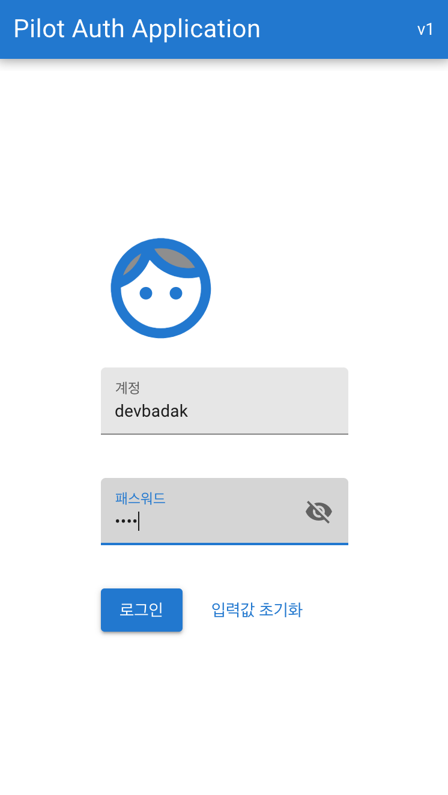
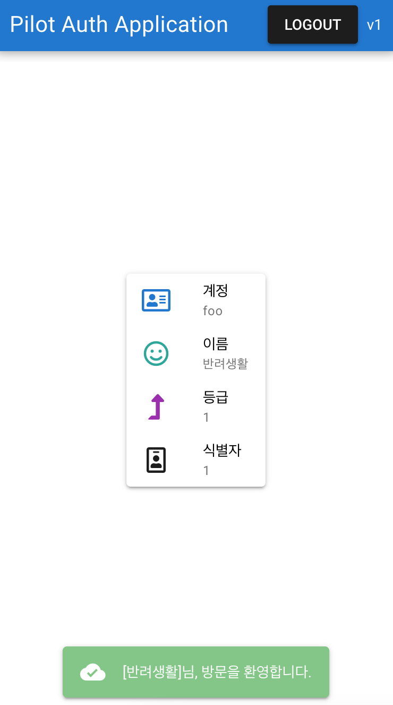

# Pilot-auth-ui app

## 개요
[Quasar Framework v2](https://quasar.dev/) 을 사용한 app 입니다. 따라서, vue.js v3 과 webpack v5 이 사용됐습니다.

1. postman을 사용하길 원한다면, [pilot-auth api.postman_collection.json](./pilot-auth api.postman_collection.json) 을 import하길 바랍니다.
2. 현재 server host를 http://localhost:5000 으로 가정하고 작성된 소스코드입니다. 따라서, 바꾸고 싶다면, [src/boot/axios.ts](./src/boot/axios.ts) 파일의 baseURL 값을 변경 바랍니다.
3. 앱 사진:

로그인 페이지             |  사용자 정보 페이지
:-------------------------:|:-------------------------:
 | 

[comment]: <> ()

## Install the dependencies
```bash
yarn
```

### Start the app in development mode (hot-code reloading, error reporting, etc.)
```bash
quasar dev
```

### Lint the files
```bash
yarn run lint
```

### Build the app for production
```bash
quasar build
```

### Customize the configuration
See [Configuring quasar.conf.js](https://v2.quasar.dev/quasar-cli/quasar-conf-js).
